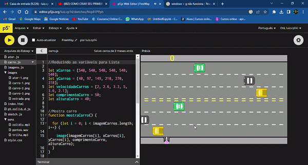

# FreeWay Game
Jogo FreeWay utilizando JavaScript. 
  

    

## Description:
Este simples projeto, foi criado para reforçar **lógica de programação** e melhor as habilidades com **Javascript**. Principalmente para organização do código no geral, como pode ser visto imagens e sons separados por arquivos. Além de otimizar o código, mantendo mais enxuto e de melhor compreensão, após realizar refactor de algumas linhas. Foram usados bastante métodos de **laços(arrays) e listas**. 
O personagem pode ser controlado pelo usuário, caso o mesmo consiga atravessar a rua, marca um ponto, senão retorna para posição inicial e se já tiver um ponto marcado, perde.
